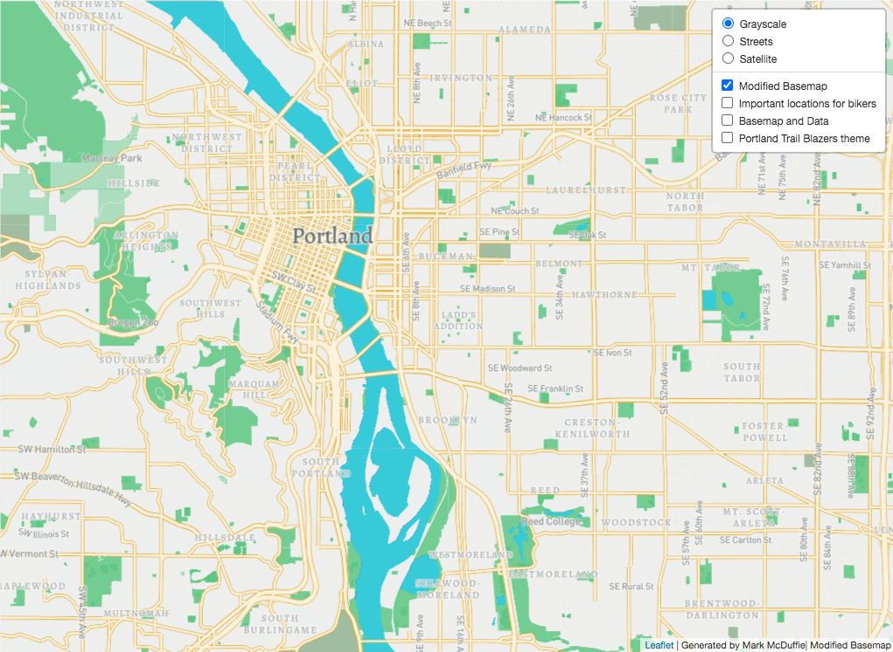
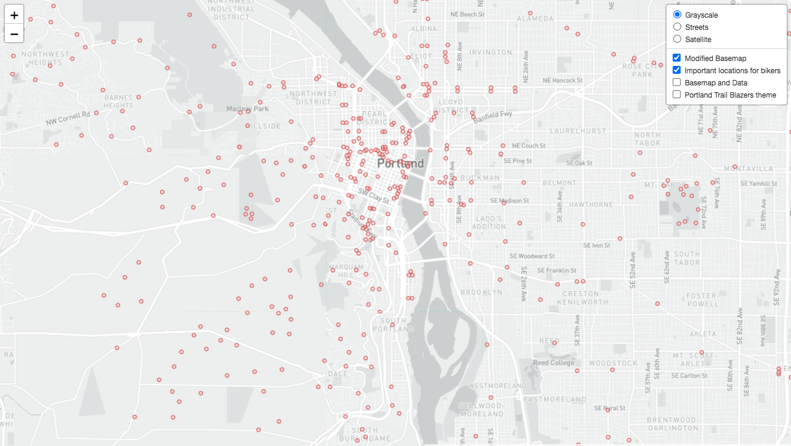
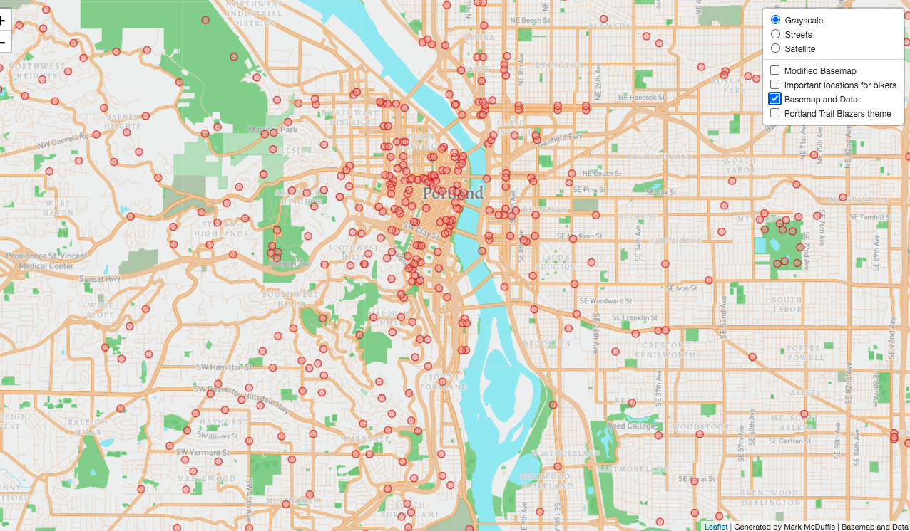
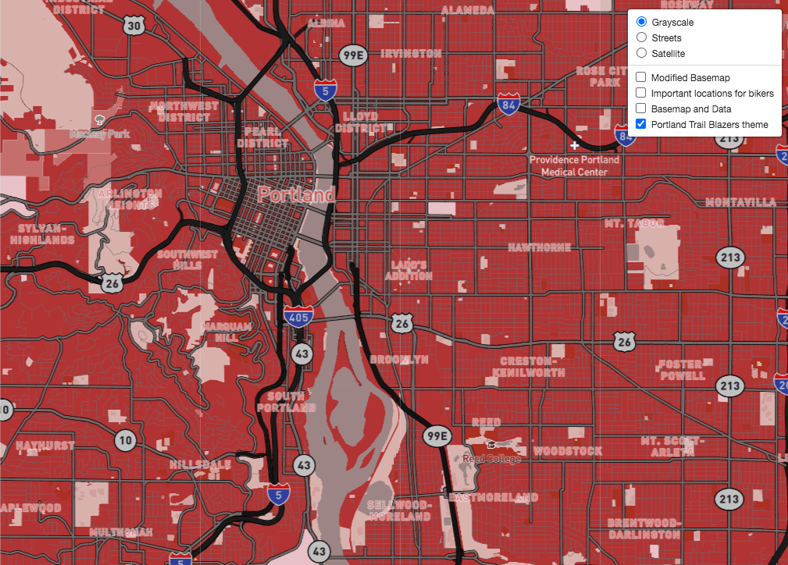

# Lab 4: Designing Maps with tile generation

This project includes 4 different tile sets of the city of Portland, OR

## Tile 1: Modified Monochrome Basemap

- Description of Tile: Modified basemap with different colors and text to emphasize streets, green areas, and water bodies in downtown area.
- Geographic Area of Focus: Portland, OR metro Area 
- Zoom Levels: Max Zoom - 14; Min Zoom - 10

## Tile 2 Screenshot - Map Data (Unreinforced Masonry Buildings, Seattle)

- Description of Tile: Data layer showing locations of significance to bikers around the city. These include bike shops, places of steep elevation change, and difficult connections on the city's bike network  
- Geographic Area of Focus: Portland, OR metro Area
- Zoom Levels: Max Zoom - 14; Min Zoom - 10

## Tile 3 Screenshot - Basemap and Data 

- Description of Tile: Tile utilizing the modified basemap from Tile 1 overlayed with the data from Tile 2
- Geographic Area of Focus: Portland, OR metro Area 
- Zoom Levels: Max Zoom - 14; Min Zoom - 10

## Tile 4 Screenshot - Seattle Supersonics Theme

- Description of Tile: Map tile made using the color scheme from the former Portland Trail Blazers NBA team. 
- Geographic Area of Focus: Portland, OR metro Area 
- Zoom Levels: Max Zoom - 14; Min Zoom - 10
